  

  

## 🚀 About Me

  

 

  <table>
    <tr>
      <td align="center" width="50%">
        
      </td>
      <td align="center" width="50%">
        

          <h3>🏆 Key Highlights</h3>
          <ul>
            <li>🥇 <strong>Winner of BlitzBuzz</strong> tech event</li>
            <li>📄 Published research on <strong>"Blockchain's Role in Advancing Green Solutions"</strong></li>
            <li>💡 Love building <strong>full-stack applications</strong> that solve real-world problems</li>
            <li>🚀 <strong>2 Professional Internships</strong> completed</li>
            <li>🎯 Consistent problem solver with <strong>algorithmic expertise</strong></li>
          </ul>
        

      </td>
    </tr>
  </table>

---

## 🛠️ Tech Skills Tree

  
# 🌟 ARIVUSELVAM'S TECH UNIVERSE 🌟

```mermaid
graph TD
    A[🌟 ARIVUSELVAM'S TECH UNIVERSE 🌟] --> B[🧠 Problem Solving<br>800+ LeetCode]
    A --> C[📈 Data Structures & Algorithms<br>Core CS Skills]
    C --> D[🌐 Full Stack Web Development]
    C --> E[📊 Data & Analytics]
    
    D --> F[🎨 Frontend]
    D --> G[⚙️ Backend]
    D --> H[🔧 Dev Tools]
    
    F --> I[📱 React]
    F --> J[🎭 JavaScript]
    F --> K[💄 CSS]
    F --> L[🎨 HTML]
    F --> M[🎪 UI/UX Design]
    
    G --> N[🐍 Python]
    G --> O[⚡ Node.js]
    G --> P[🍃 MongoDB]
    G --> W[📅 Postgres]
    G --> Q[📡 REST API]
    
    H --> R[🔧 Git/GitHub]
    H --> V[👁️ Postman]

    E --> S[📈 Power BI]
    
    A --> T[☕ Java<br>General Purpose, Backend]
    A --> U[🌱 Learning & Expanding Horizons]
    
    style A fill:#0f172a,stroke:#6366f1,stroke-width:4px,color:#ffffff
    style B fill:#1e293b,stroke:#22d3ee
    style C fill:#1e293b,stroke:#22d3ee
    style D fill:#1e293b,stroke:#f59e0b
    style E fill:#1e293b,stroke:#f59e0b
    style F fill:#334155,stroke:#38bdf8
    style G fill:#334155,stroke:#38bdf8
    style H fill:#334155,stroke:#38bdf8
    style I fill:#475569,stroke:#60a5fa
    style J fill:#475569,stroke:#60a5fa
    style K fill:#475569,stroke:#60a5fa
    style L fill:#475569,stroke:#60a5fa
    style M fill:#475569,stroke:#60a5fa
    style N fill:#475569,stroke:#34d399
    style W fill:#475569,stroke:#34d399
    style O fill:#475569,stroke:#34d399
    style P fill:#475569,stroke:#34d399
    style Q fill:#475569,stroke:#34d399
    style R fill:#475569,stroke:#a78bfa
    style V fill:#475569,stroke:#a78bfa
    style S fill:#475569,stroke:#fbbf24
    style T fill:#1e293b,stroke:#f43f5e
    style U fill:#1e293b,stroke:#84cc16
```

---

## 📊 GitHub Stats & Activity

  

 

  <table>
    <tr>
      <td align="center">
        
      </td>
      <td align="center">
        
      </td>
    </tr>
  </table>

 

 

  

 

  

---

## 🎯 Featured Projects & Repositories

  

 

  <table>
    <tr>
      <th colspan="2">🌾 Smart Agriculture System</th>
    </tr>
    <tr>
      <td align="center" width="50%">
        
      </td>
      <td align="left" width="50%">
        <strong>Tech Stack:</strong> React • Node.js • MongoDB • Machine Learning  
        <strong>Features:</strong> Crop price prediction, region-based selection, e-commerce module  
        <strong>Impact:</strong> Helps farmers make informed decisions about crop selection and pricing
      </td>
    </tr>
  </table>

 

  <table>
    <tr>
      <th colspan="2">🤖 Gemini AI Clone</th>
    </tr>
    <tr>
      <td align="left" width="50%">
        <strong>Tech Stack:</strong> React • JavaScript • Gemini API  
        <strong>Features:</strong> Real-time conversational AI, modern UI/UX  
        <strong>Impact:</strong> Interactive chatbot with advanced AI capabilities for seamless user experience
      </td>
      <td align="center" width="50%">
        
      </td>
    </tr>
  </table>

 

  <table>
    <tr>
      <th colspan="2">🏢 Dealer Management System</th>
    </tr>
    <tr>
      <td align="center" width="50%">
        
      </td>
      <td align="left" width="50%">
        <strong>Tech Stack:</strong> React • Node.js • MongoDB • bcrypt  
        <strong>Features:</strong> Secure authentication, incident tracking, email automation  
        <strong>Impact:</strong> Streamlined dealer operations with enhanced security and efficiency
      </td>
    </tr>
  </table>

 

  <table>
    <tr>
      <th colspan="2">💼 Professional Portfolio</th>
    </tr>
    <tr>
      <td align="left" width="50%">
        <strong>Live Demo:</strong> <a href="https://arivuselvams.netlify.app">arivuselvams.netlify.app</a>  
        <strong>Features:</strong> Responsive design, project showcase, contact integration  
        <strong>Impact:</strong> Professional online presence showcasing skills and achievements
      </td>
      <td align="center" width="50%">
        
      </td>
    </tr>
  </table>

---

## 💼 Professional Experience

  

### 🏢 Titan Company Limited - Full Stack Development Intern
**Duration:** November 2024  
- 🔐 Developed secure Dealer Management System
- 🛡️ Implemented encrypted authentication with bcrypt
- 📧 Built automated email credential delivery system
- 📊 Created incident tracking features for operational efficiency

### 💻 Frenzo Technologies - Python & Web Development Intern  
**Duration:** July 2024 - August 2024  
- 🐍 Built dynamic web applications using Django
- 🔄 Contributed to full-stack development with HTML, CSS, JavaScript
- 👥 Participated in team-based development and module integration

---

## 🏆 Achievements & Certifications

| 🎯 Achievement | 📝 Description |
|---------------|----------------|
| 🧩 **700+ LeetCode Problems** | Strengthened algorithmic and problem-solving skills |
| 🔥 **100-Day LeetCode Streak** | Consistent daily practice and improvement |
| 🥇 **BlitzBuzz Winner** | First place in tech event showcasing creativity |
| 📄 **Research Paper** | "Blockchain's Role in Advancing Green Solutions" |
| 🎓 **AWS Cloud Computing** | NPTEL Certification |
| ⚡ **Prompt Engineering** | Advanced AI interaction techniques |

---

## 🌟 Skills Matrix

---

## 📈 Contribution Graph

  

 

  

---

## 🤝 Let's Connect!

  

---

  

  

  <h3>💫 "Code is like humor. When you have to explain it, it's bad." - Cory House</h3>

